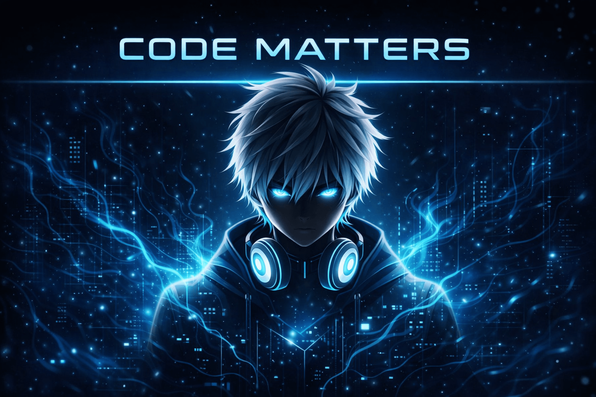

  

# 🌌 CODE MATTERS

---

# 👋 Hello, I'm Rishabh (Nyx)

## 🚀 About Me
I am a passionate developer who enjoys building creative and functional web projects.  
Currently focused on improving my skills in frontend and programming fundamentals.  
I love exploring new technologies and turning ideas into real-world projects.

- 💻 Interested in Web Development & Programming  
- 🌱 Currently learning and growing every day  
- ⚡ Fun fact: I enjoy solving logical problems and building interactive UI  
- 🎮 Hobbies: Gaming, Cycling and Learning new AI tech
---

## 🔥 Latest Project

### ⚔️ Clash Cyber
A browser-based fighting game built using HTML, CSS, and JavaScript.  
Features include attack mechanics, healing system, character selection, and critical hit logic.

🔗 https://clash-cyber.netlify.app

---

## 🌐 Connect With Me

  
  
  

---

## 🛠️ Languages & Tools

  
  
  
  

---

## 📊 GitHub Stats

  

---

## 📈 Most Used Languages

  

---

## 🔥 Streak Stats

  

---

## 🧠 What I Do

- Build responsive and interactive websites  
- Work on creative coding projects  
- Practice problem-solving and logic building  
- Explore new tech and tools  

---

## 🎯 Goals

- 🚀 Become a skilled full-stack developer  
- 📚 Master advanced JavaScript & Python  
- 🌍 Build impactful and useful projects  

---

## ⭐ Support Me

If you like my work, consider giving a ⭐ to my repositories!

---
